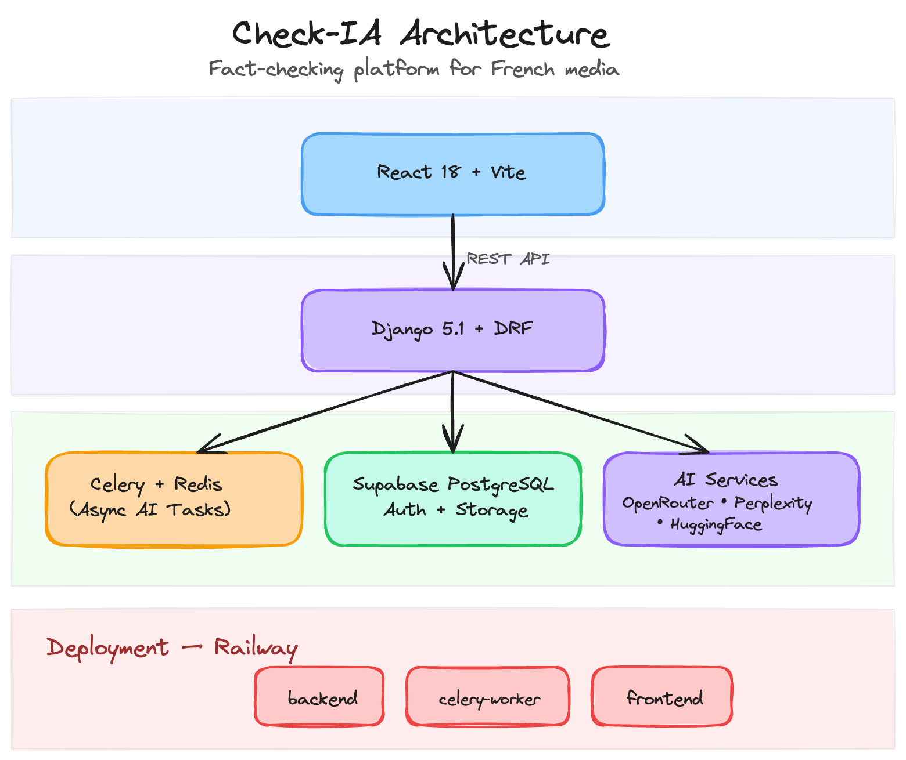

# Architecture Overview

Check-IA follows a standard client-server architecture with asynchronous task processing for AI-intensive operations.

## System Diagram

## Components

### Frontend (React)

The React 18 single-page application handles user interaction, authentication flows, and result display. Key libraries include Material-UI for the component system and Supabase JS for client-side authentication.

**Location:** `client/src/`

### Backend (Django)

Django 5.1 with Django REST Framework provides the API layer. It handles request validation, authentication verification, database operations, and task dispatching.

**Location:** `config/` (project settings), `core/` (application code)

### Task Queue (Celery + Redis)

AI analysis operations are long-running (10-30 seconds). Celery processes these asynchronously so the API can return immediately with a task ID. The frontend polls for results using the task status endpoint.

**Location:** `config/celery.py`, `core/tasks.py`

### Supabase

Supabase provides three services:

- **PostgreSQL Database** — Stores facts, submissions, keywords, and verification results
- **Authentication** — JWT-based auth with email/password. The Django backend validates Supabase JWTs via a custom authentication class (`core/authentication.py`)
- **Storage** — Image uploads for verification are stored in Supabase Storage buckets

### AI Services

Multiple external AI APIs power the verification pipeline. See [AI Pipeline](ai-pipeline.md) for details.

## Deployment

The application runs on [Railway](https://railway.app) as three separate services:

- **backend** — Django + Gunicorn (serves the REST API)
- **celery-worker** — Celery worker process (handles async AI tasks)
- **frontend** — Static React build served by Caddy

Deployments are triggered automatically via GitHub Actions on push to `main`.
